# Sprint1-WireframeAF

En este repositorio se encuentran esquemas para una aplicación de control de asistencias.
Esquemas tanto para entorno móvil como entorno web.
 
Utilice los siguientes links para moverse rapidamente entre esquemas sin necesidad de buscarlos a mano:

## Links del esquema móvil

Link al esquema directo a figma: [Wireframe project](https://www.figma.com/design/cH7xdUCLiKycdnPRjuhHmf/Wireframe-Projecte?node-id=48-370&t=HldrrPDBGTX1doM5-1) 

- Login
- Cuenta (por arreglar)
- Asistencia como alumno
- Asistencia como profesor
- Pasando lista
- Horario de alumno
- Horario de profesor
- Seguimiento de alumno
- Seguimiento de profesor
- Monitoreo de errores para admin (por hacer)

## Links del esquema web

- .
- .

## Esquema móvil

El esquema esta mayormente hecho, requiere unas pocas implementaciones extra, como el monitoreo de errores, y poder navegar libremente. 
Se debe tomar la desicion de si usar un menu hamburguesa o usando el menu inferior como suficiente.
Falta explicar como funciona cada esquema para cada pantalla y agrupar los esquemas en común para facil legibilidad.

### Login móvil

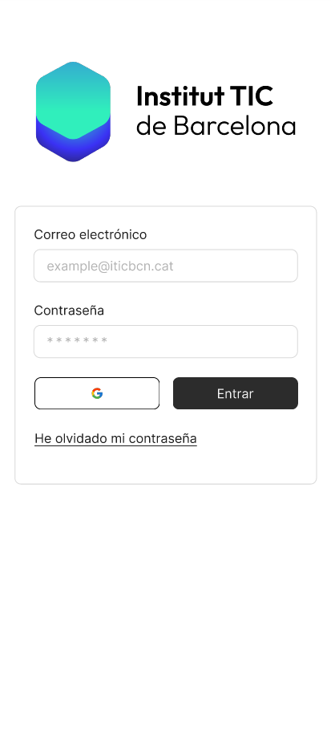

### Cuenta móvil

Por arreglar, falta implementar una un menu u opcion para salir de la cuenta etc.

### Asistencia como alumno

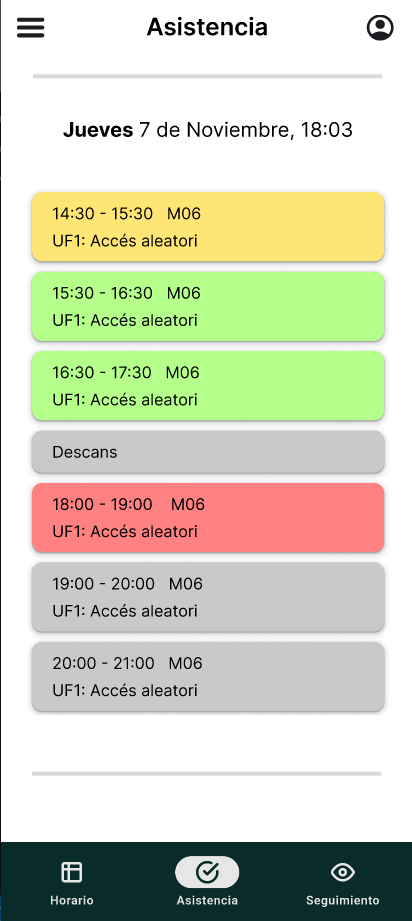

### Asistencia como profesor

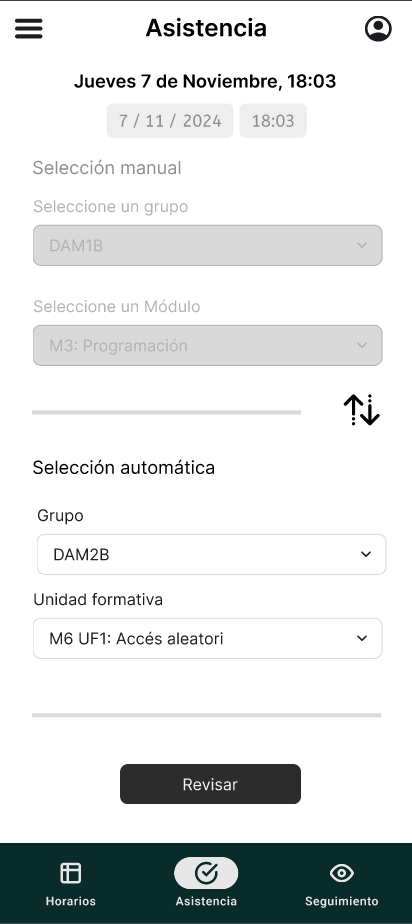

### Pasando lista

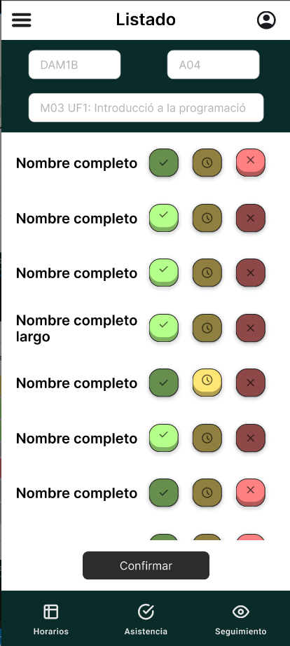

### Horario de alumno

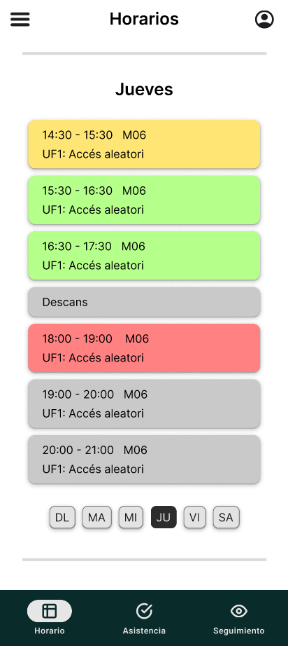

### Horario de profesor

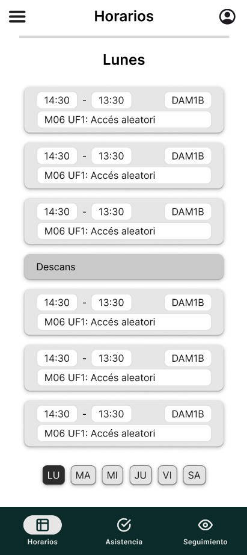

### Seguimiento de alumno

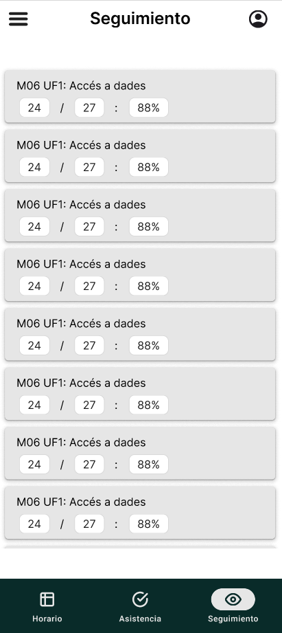

### Seguimiento de profesor

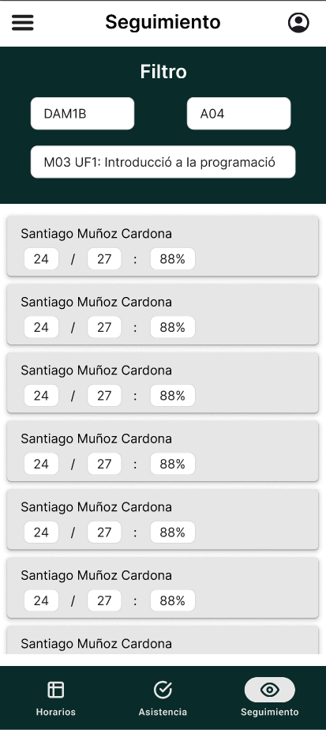

## Esquema web

Este esquema contiene una pagina de login, una de asistencia para los tres roles (alumno, profesor y administrador), una pagina de horario para los tres roles, una pagina para pasar lista solamente para los roles de profesor y administrador,
una pagina de seguimiento para los tres roles y una ultima pagina de cuenta para los tres roles.
Estas son las capturas de pantalla:

- [Pagina de login](#pagina-de-login)
- [Pagina asistencia alumno](#pagina-asistencia-alumno)
- [Pagina horario alumno](#pagina-horario-alumno)
- [Pagina seguimiento alumno](#pagina-seguimiento-alumno)
- [Pagina cuenta alumno](#pagina-cuenta-alumno)
- [Pagina asistencia profesor](#pagina-asistencia-profesor)
- [Pagina listado profesor](#pagina-listado-profesor)
- [Pagina horario profesor](#pagina-horario-profesor)
- [Pagina seguimiento profesor](#pagina-seguimiento-profesor)
- [Pagina cuenta profesor](#pagina-cuenta-profesor)
- [Pagina asistencia administrador](#pagina-asistencia-administrador)
- [Pagina listado administrador](#pagina-cuenta-administrador)
- [Pagina horario administrador](#pagina-horario-administrador)
- [Pagina seguimiento administrador](#pagina-seguimiento-administrador)
- [Pagina cuenta administrador](#pagina-cuenta-administrador)

### Pagina de login

Cuando accedamos a la pagina nos saldra una pagina de inicio de sesion, donde nos pide rellenar los siguientes campos que se ven en la imagen.
Ademas de los tipicos campos de email y contraseña hay un campo extra en la cual debes indicar cual es tu rol.

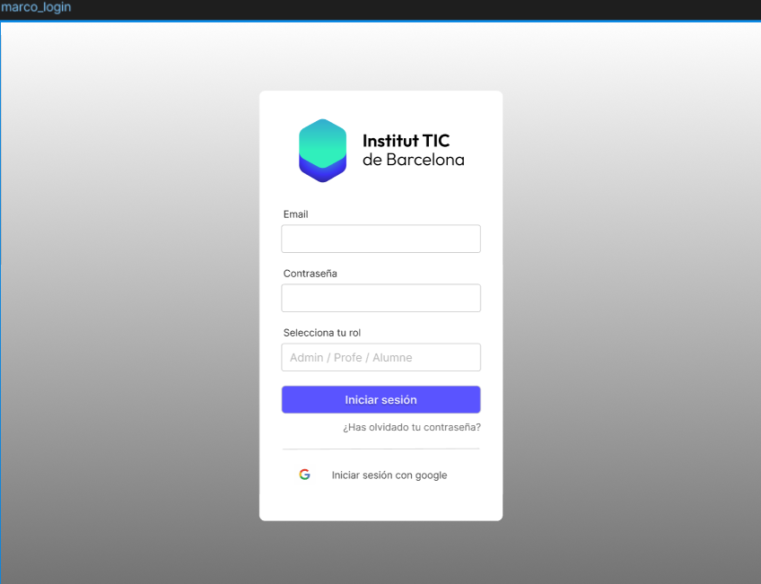  

### Pagina asistencia alumno

Si accedemos como alumno, veremos la siguiente pagina. Esta pagina esta conformada por una cabecera con una barra de navegacion.
Esta pagina se centra en mostrar al alumno los diferentes tipos de asistencia que tiene. Tambien hay que remarcar que hay unos cuatro botones que tienen los nombres de los diferentes tipos de asistencia.
Si picas el boton de "Absent" te mostrara unicamente las clases en las que hayas faltado.
Al final de la pagina podemos ver la tipica informacion que se pone en el footer, por ejemplos las condiciones generales, ajuda, etc.

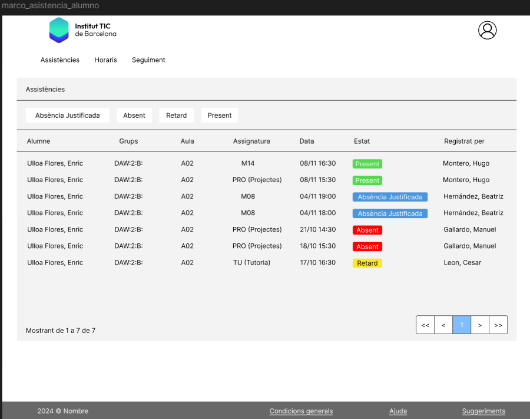  

### Pagina horario alumno

En esta pagina el alumno vera su horario, viendo asi las diferentes clases en las que debe asistir. El horario indica el aula a donde tiene que ir y que asignatura va a ver. Tambien indica a que grupo pertenece, en este caso por ejemplo al grupo "DAW2B".
Este horario cambiara dependiendo del grupo en el que va el alumno.

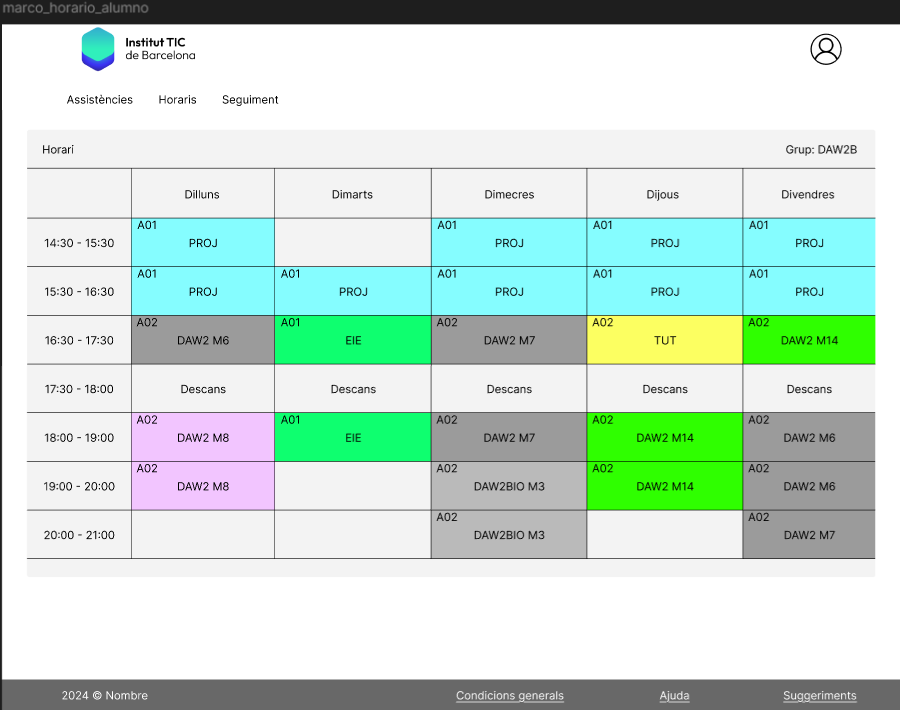  

### Pagina seguimiento alumno

En esta pagina el alumno vera el porcentaje de asistencias que tiene por cada asignatura.

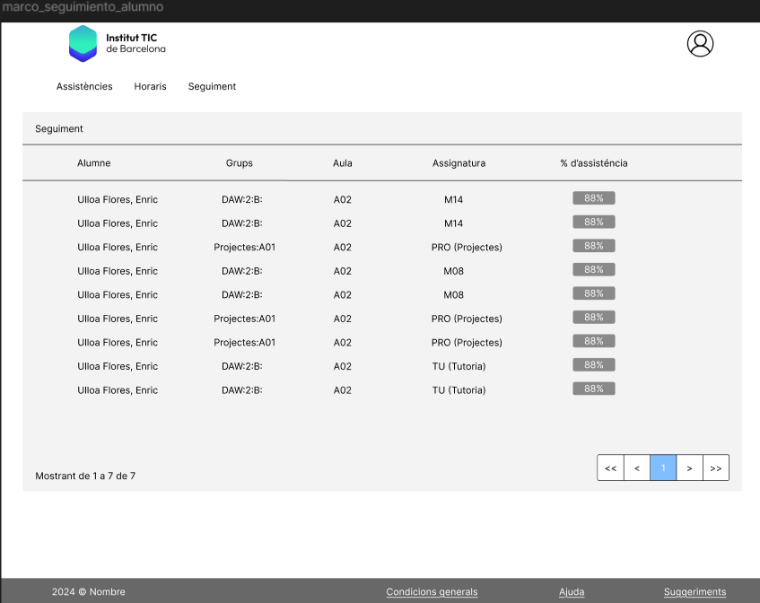  

### Pagina cuenta alumno

Aqui el alumno vera su perfil con la siguente informacion que se ve en la imagen. Para acceder a esta pagina se debera picar al icono de usuario que esta en la esquina superior derecha.

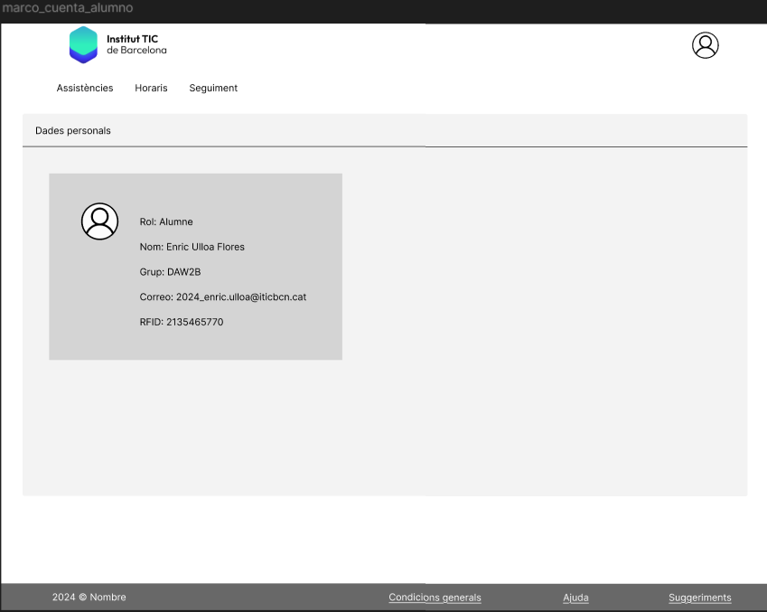  

### Pagina asistencia profesor

Si nuestro rol es de profesor veremos que podemos filtrar por aula, grupo y assignatura.

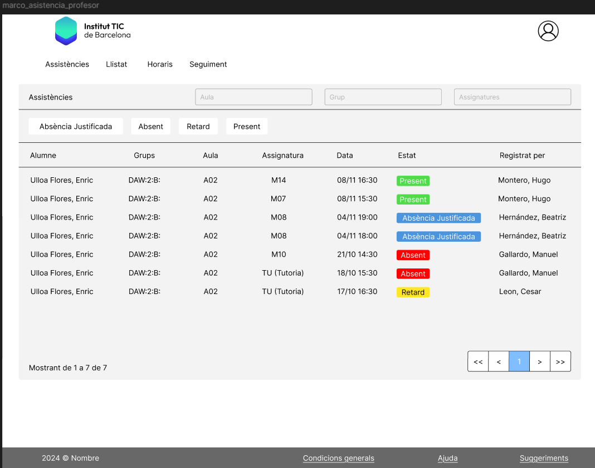  

### Pagina listado profesor

Esta pagina esta dedicada para que el profesor pase lista a sus alumnos, pudiendo filtrar por grupo, assignatura y aula.

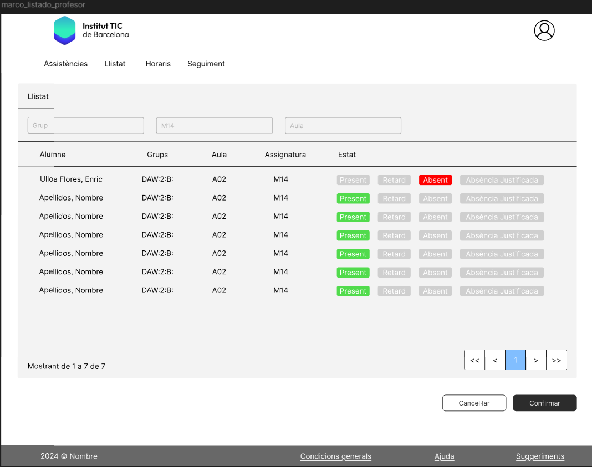  

### Pagina horario profesor

Aqui el profesor vera su horario, viendo las clases que le toca, en que aula ha de ir y a que grupo dara clase. Esto cambiara dependiendo del profesor.

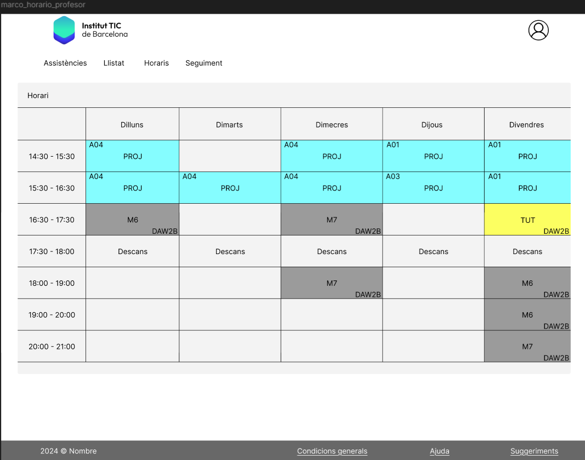  

### Pagina seguimiento profesor

El profesor podra ver el porcentaje de asistencias de sus alumnos, pudiendo filtrar por grupo, aula y asignatura.

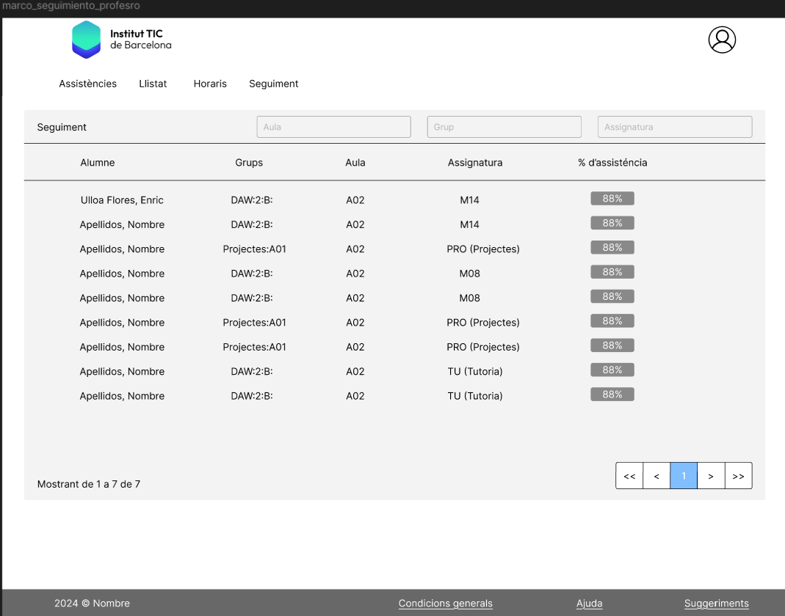  

### Pagina cuenta profesor

Igual que con alumno, pero con unas leves variaciones por ser profesor.

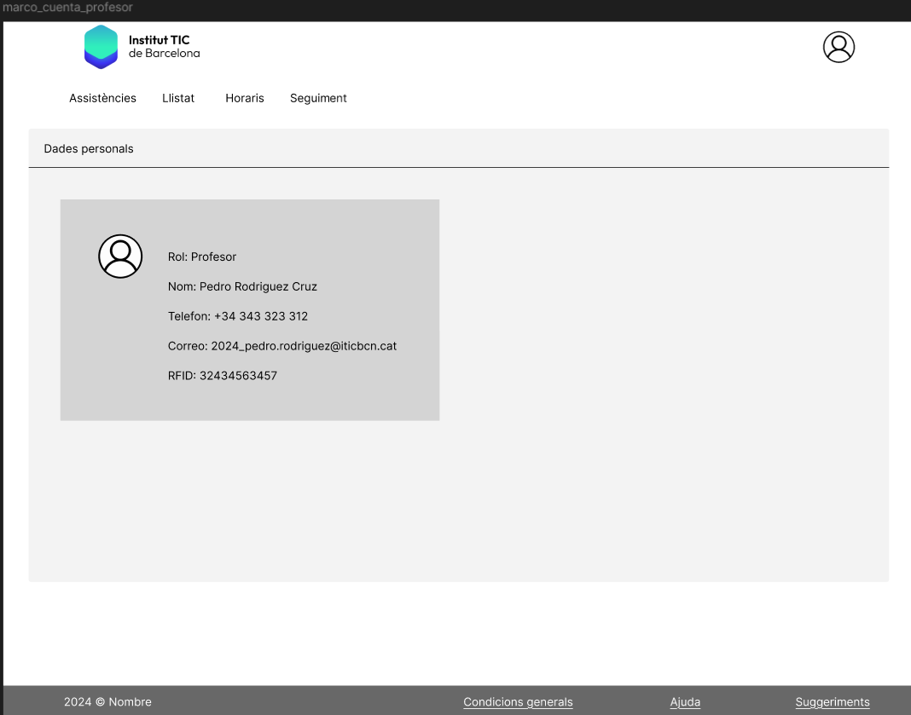  

### Pagina asistencia administrador 

Es practicamente igual que el del profesor.

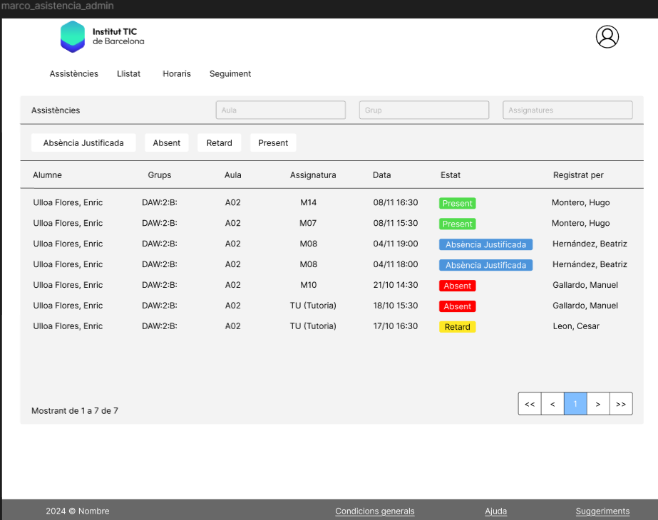  

### Pagina listado administrador

Es practicamente igual que el del profesor.

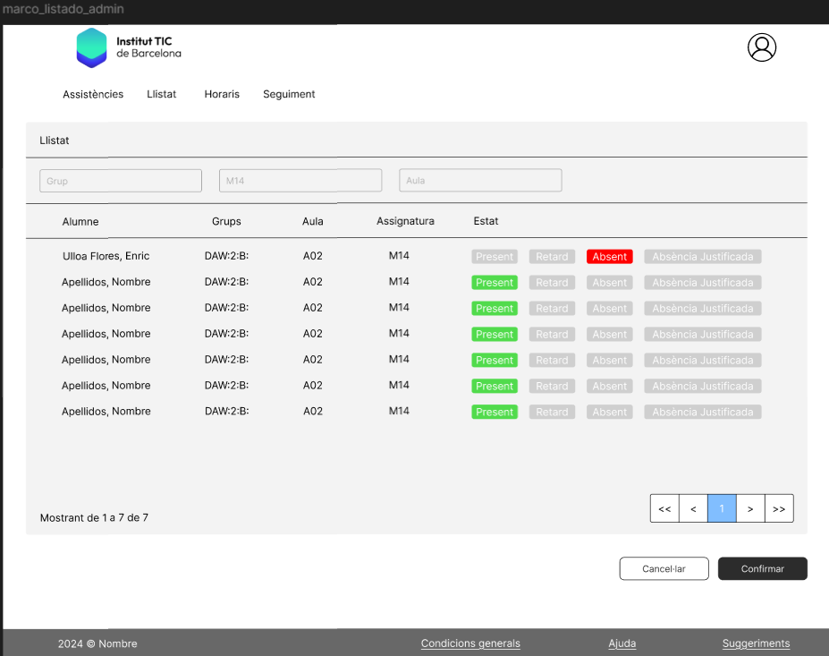  

### Pagina horario administrador

Aqui el administrador podra filtrar para buscar entre los multiples profesors y grupos.

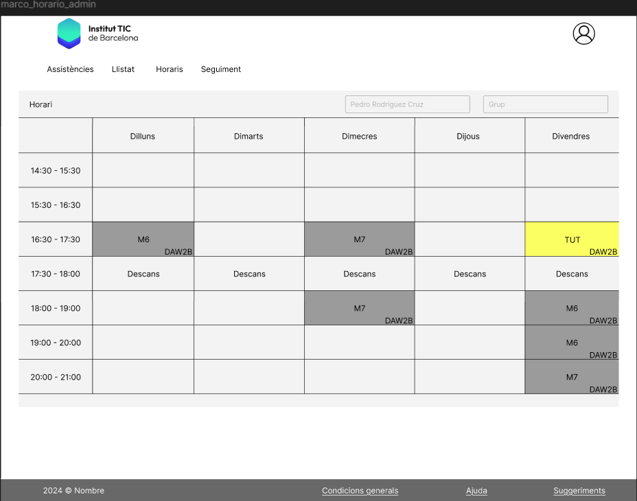  

### Pagina seguimiento administrador

Es practicamente igual que el del profesor.

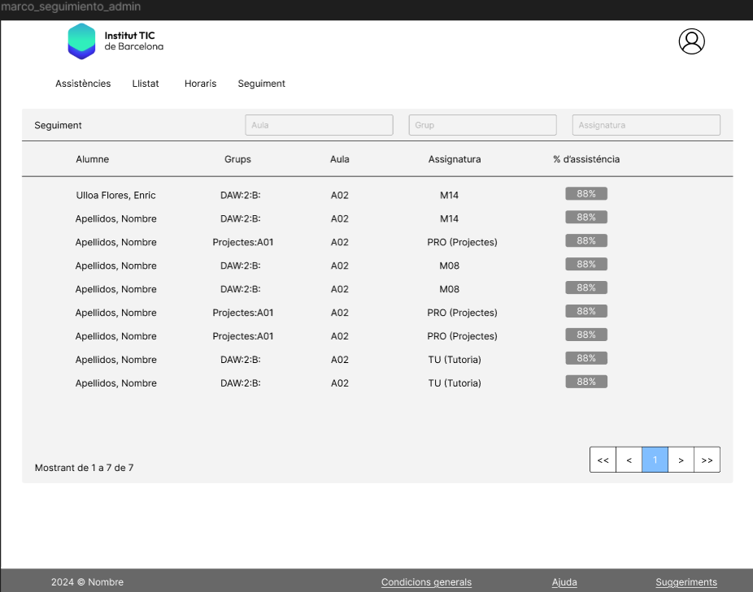  

### Pagina cuenta administrador

El mismo formato que los dos roles anteriores, pero en este caso para rol de administrador.

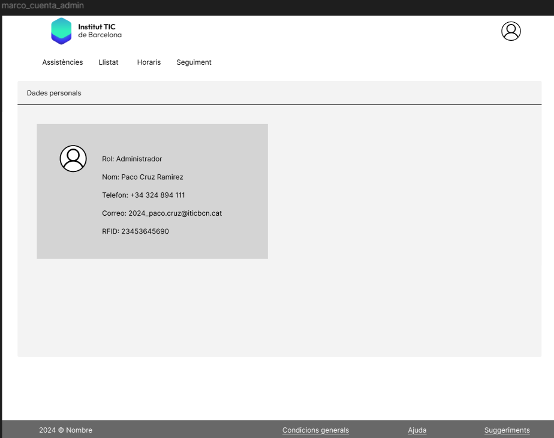  
